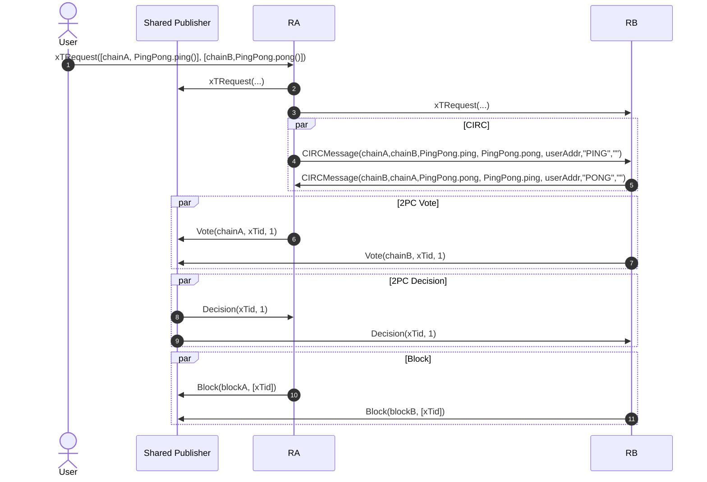

# Proof-of-Concept

The PoC aims to demonstrate the well-functioning of the shared publisher solution for synchronous composability in a smaller controlled scenario.

## Components

- A user who submits a cross-chain transaction.
- A [Shared Publisher (SP)](#shared-publisher) client.
- Two [rollups sequencers](#rollups--sequencers) denoted by A and B for rollups denoted by `chainA` and `chainB`, respectively.

## Test Scenario
1. A user submits a cross-chain transaction request, *xTRequest*(chain A: `PingPong.ping()`, chain B: `PingPong.pong()`), to a sequencer, who then disseminates it to the shared publisher and to other sequencers.
2. Sequencers simulate their transactions and exchange *CIRCMessage* messages.
3. After the necessary messages are received and the transaction can be fully executed, sequencers send a *Vote* message to the shared publisher.
4. The shared publisher sends a *Decided* message to the sequencers.
5. Sequencers send the L2 block (*Block*) with the transaction to the shared publisher.


## Messages

```protobuf
// User request
message xTRequest {
    repeated TransactionRequest transactions = 1;
}
message TransactionRequest {
    bytes chainID = 1;
    repeated bytes transaction = 2;
}
// CIRC
message CIRCMessage {
    bytes sourceChain = 1;
    bytes destinationChain = 2;
    repeated bytes source = 3;
    repeated bytes receiver = 4;
    uint16 sessionID = 5;
    string label = 6;
    repeated bytes data = 7; // ABI encoded arguments
    uint16 xTid = 8;
}
// 2PC
message Vote {
    bytes senderChain = 1;
    uint16 xTid = 2;
    bool vote = 3;
}
message Decided {
    uint16 xTid = 1;
    bool decision = 2;
}
// Block
message Block {
    repeated bytes block = 1;
    repeated uint16 includedxTs = 2;
}
```

where:
- `Block.block` is an encoded [Ethereum block](https://github.com/ethereum/go-ethereum/blob/master/core/types/block.go).
- `TransactionRequest.transaction` is an encoded [Ethereum transaction](https://github.com/ethereum/go-ethereum/blob/master/core/types/transaction.go).

## Communication

Communication is direct protobuf with hardcoded endpoints on each client.

## Rollups & Sequencers

Both rollups, `chainA` and `chainB`, should be deployed in Hoodi following a [OP stack](https://github.com/ethereum-optimism/optimism) deployment guide. The chain ID of each rollup should be fetched after the deployment. The rollup will use the [OP-Succint](https://github.com/succinctlabs/op-succinct) framework for validity ZK proofs, though this is not covered in this phase.

Both should have the following smart contracts deployed on them:
- [**Mailbox**](./contracts/mailbox.sol): manages message-passing (based on [CIRC](https://espresso.discourse.group/t/circ-coordinated-inter-rollup-communication/43#p-59-mailbox-8)).
- [**PingPong**](./contracts/pingpong.sol): a contract with two functions:
    - `ping`: sends a *PING* message and reads a *PONG*.
    - `pong`: reads a *PING* message and sends a *PONG*

The sequencer module should be changed to behave in the following way:
- In the beginning of the block, add a transaction for clearing the Mailbox.
- Upon receiving a cross-chain transaction request (*xTRequest*) for the first time:
    1. If receiving from a user, disseminate it to the shared publisher and to other participating sequencers.
    2. Start a timer.
    3. Simulate the transaction and send newly generated CIRC messages to the destination sequencers.
    4. If simulation does **not** fail due to missing a CIRC message in a `mailbox.read`, go to 7.
    5. Wait for CIRC messages from other sequencers.
    6. Upon receiving a message, add it as a top-of-block transaction and go to 3.
    7. Start the 2PC protocol by sending a vote with the transaction execution status to the SP.


> [!TIP]
> For the purpose of the PoC, the following algorithms assume that the system will receive only **one** cross-chain transaction, and that no normal transaction (non cross-chain) is received.
> A more general algorithm would need a proper management of the many cross-chain transactions throughout a block.


**Sequencer Algorithm**
```r
state variables
    ownChainID
    timer
    xTID
    localTx
    2pcInstance

procedure BeginBlock()
    AddTransaction(ClearMailboxTx)
    xTID ← ⊥
    localTx ← ⊥

# Cross-chain transaction request
upon receiving a xTRequest(txs) (if from a user, propagate it to the SP and to all sequencers of chains appearing in txs)
    set timer to running and expire after 3 minutes

    xTID ← hash(txs)
    localTx ← txs.selectTransactionToChain(ownChainID)

    2pcInstance.Create(ownChainID, xTID)

    SCProtocol()

# Sync composability protocol
procedure SCProtocol()
    ready, vote = TransactionSimulation()
    if ready == 1 then do
        Start2PC(vote)

# TX simulation
procedure TransactionSimulation() returns <ready, vote>
    result, newCIRCMsgs ← Simulate(localTx)

    # Send CIRC msgs
    for msg in newCIRCMsgs do
        send msg to the sequencer of the destination chain

    # Result
    if result == failure_due_to_mailbox_read then do
        return <0, ⊥>
    else do
        return <1, result>

upon receiving a new CIRCMessage do
    AddCIRCMessageAsTopOfBlockTransaction(CIRCMessage)
    SCProtocol()

procedure Start2PC(vote)
    2pcInstance.Vote(vote)

upon timer is expired do
    2pcInstance.TimerExpired()
```


**2PC Algorithm for Sequencer**
```r
state variables
    ownChainID
    xTID
    vote ← ⊥
    decision ← ⊥

procedure Create(_ownChainID, _xTID)
    ownChainID ← _ownChainID
    xTID ← _xTID
    vote ← ⊥
    decision ← ⊥

procedure Vote(proposedVote)
    # Ensure it has not yet voted
    if vote != ⊥:
        return

    vote = proposedVote
    send Vote(ownChainID, xTID, vote) to the shared publisher

procedure TimerExpired()
    # Ensure it has not yet voted
    if vote != ⊥:
        return

    vote ← 0
    send Vote(ownChainID, xTID, 0) to the shared publisher

upon receiving a Decided(xTID, _decision) message from the shared publisher do
    decision ← _decision
```

## Shared Publisher (SP)

The SP should:
- receive blocks from the rollups.
- upon a new xTRequest, start the 2PC protocol as leader.

**2PC Algorithm for the leader replica (SP)**
```r
state variables
    decision
    xTid
    participatingRollups
    rollupsThatVoted1
    timer

upon receiving a xTRequest(txs)
    decision ← ⊥
    xTid ← hash(txs)
    participatingRollups = set(chainID for {chainID,_} in txs)
    rollupsThatVoted1 ← set()
    set timer to running and expire after 3 minutes

upon receiving a Vote(chainID, vote) message a sequencer do
    if decision != ⊥:
        return
    if chainID in rollupsThatVoted1:
        return

    # Case: vote 0
    if vote == 0:
        decision ← 0
        send Decided(xTid, 0) to all sequencers
        return

    # Case: vote 1
    rollupsThatVoted1.add(chainID)
    if rollupsThatVoted1 == participatingRollups then do # termination check
        decision ← 1
        send Decided(xTid, 1) to all sequencer>
        return

upon timer is expired do
    if decision != ⊥:
        return

    decision ← 0
    send Decided(xTid, 0) to all sequencers
```

## Test Scenario Sequence Diagram



## Assumptions

- The user can provide the whole batch of transactions which consists of transactions for different chains. This may be inconsistent with the current user interface, but a solution is currently being researched.

## Properties

- **Time complexity** is $1 + D + 2 = O(D)$, where $D$ is a dependency degree. Note that it's **not** the number of *CIRCMessages*. For example, if there are 10 messages but none depend on the other, then $D = 1$.
- **Message complexity** is $S + 1 + M + S + S = O(S + M)$, where $S$ is the number of participating rollups and $M$ is the number of *CIRCMessages*.
- **Communication complexity** is dependent on the implementation but can easily be the same as the message complexity.
- Transactions may be associated to **different accounts** in different rollups, i.e. there's no need for a common user address.
- With a simple algorithm adaptation, a cross-chain transaction may include several transactions for the same chain.

## Optimizations

Even though it's not the scope of the PoC phase, many optimizations can be applied to the current algorithm. To name a few:

- The sequencer that received the `xTRequest` from the user, can first simulate its transactions and then disseminate the request already including its CIRC messages.
- The sequencer can run normal transactions in parallel with a cross-chain transaction by only locking the contracts (and indirectly dependent contract) of the cross-chain transaction.

## Future Challenges

In a scenario with multiple transactions being submitted, a naive locking mechanism can create deadlocks.
Usually, IDs are used to resolve disputed. But, in our case, the ID of a cross-chain transaction is not incremental.
Thus, another solution is needed.
Possible ones are:
- Restrict the user to send the transaction to the shared publisher who would do the ordering job, though this may not be consistent with the current UI.
- Once a sequencer receives a `xTRequest`, sends it to the shared publisher who will, then, be responsible for really starting it, after the possibly existing one is finished.
