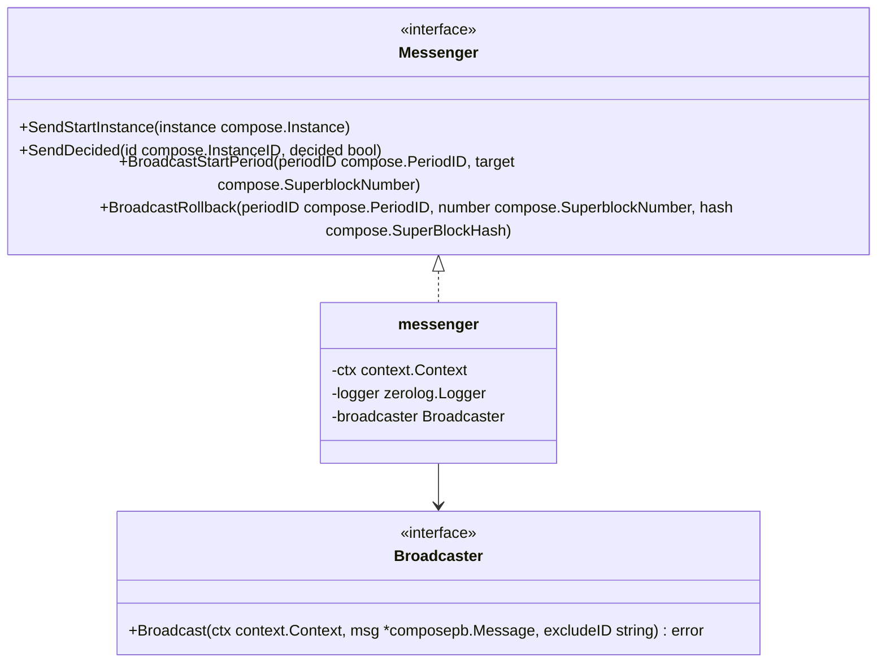

# Messenger Module

The messenger provides a thin, transport-agnostic bridge that converts high-level compose types into protobuf messages and broadcasts them to peers. It implements both the SCP `PublisherNetwork` and SBCP `Messenger` roles so protocol components can emit network notifications without depending on a concrete transport.

## Architecture

The concrete `messenger` only depends on a `Broadcaster` interface that knows how to deliver protobuf `composepb.Message` frames to connected peers. All methods construct the appropriate protobuf payloads from `compose` types and forward them via `Broadcast`.

## Message Formats

- StartInstance
  - Populates `Message_StartInstance` with:
    - `InstanceId` from `compose.InstanceID` bytes
    - `PeriodId`, `SequenceNumber`
    - `XtRequest.TransactionRequests` mapped from `compose.XTRequest.Transactions`:
      `ChainId` ← `compose.ChainID`, `Transaction` ← raw bytes

- Decided
  - Populates `Message_Decided` with `InstanceId` and `Decision` (accepted/rejected)

- StartPeriod
  - Populates `Message_StartPeriod` with `PeriodId` and target `SuperblockNumber`

- Rollback
  - Populates `Message_Rollback` with `PeriodId`, `LastFinalizedSuperblockNumber`, and `LastFinalizedSuperblockHash`

All messages set `SenderId` to `"publisher"` and broadcast to all peers (no exclusion).

## Testing Tips

- Inject a mock `Broadcaster` to capture the last sent `composepb.Message` and verify payload fields.
- Build `compose.Instance` values directly in tests; `compose.InstanceID` exposes a byte slice via `id[:]` for comparison.
- Use `zerolog.New(io.Discard)` when constructing the messenger to silence logs in tests.

## Error Handling

`Broadcast` errors are logged with context but do not propagate back to callers. Protocol components should treat message sends as best-effort and rely on their own retries or state machines for liveness.

