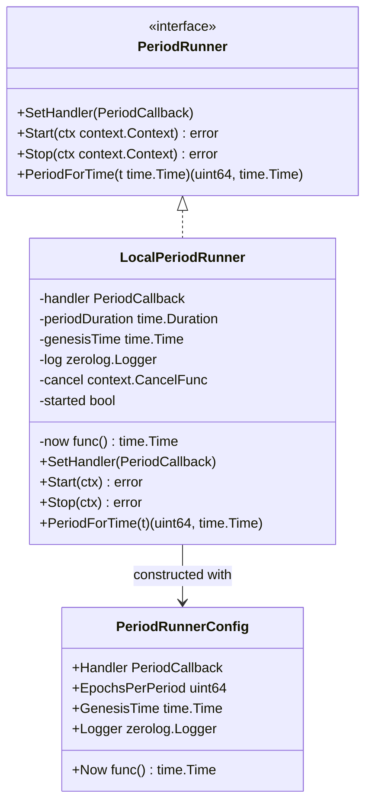
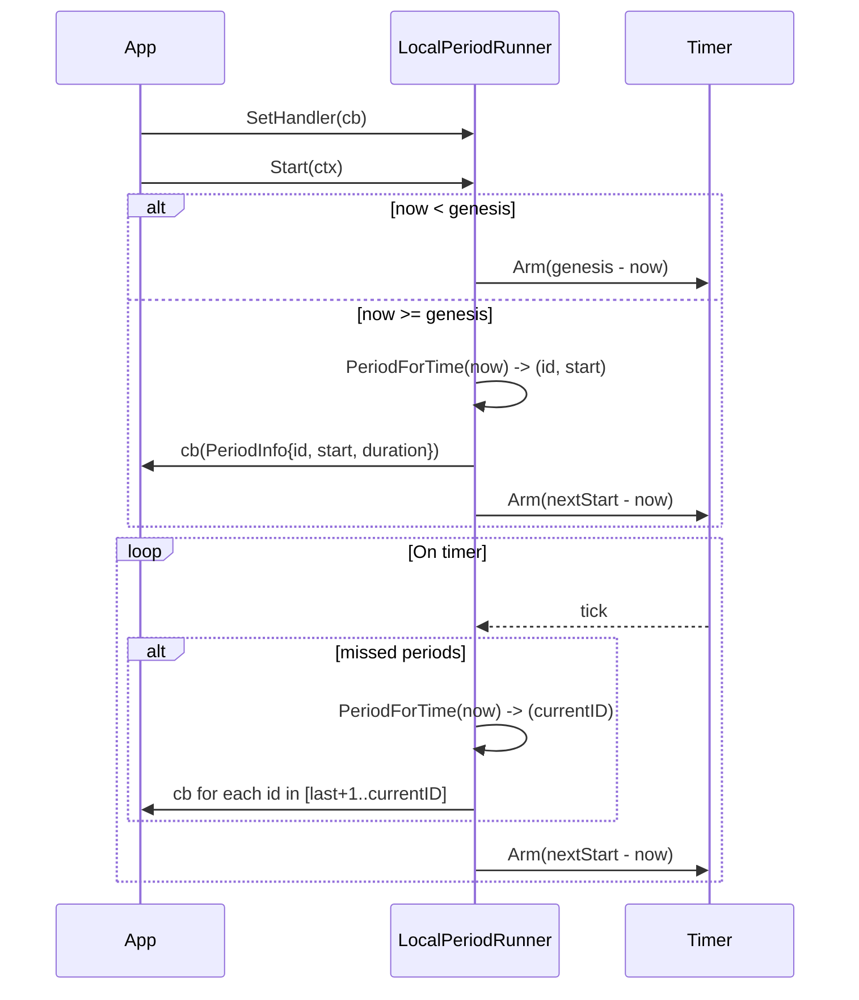

# Period Runner

The period runner emits time-based SBCP period events derived from a genesis time and an Ethereum-epoch cadence.
Components use it to receive a callback at the start of every period.

## Architecture



`LocalPeriodRunner` computes a fixed `periodDuration = EpochsPerPeriod * EthSlotsPerEpoch * EthSlotDuration` and emits an event at `genesis + K * periodDuration` for `K = 0, 1, 2, ...`. On start, it immediately emits the current period if the current time is on or after genesis, then schedules a timer for the next period. If multiple periods were missed, it will emit each missed period in order before scheduling the next one.

## Flow



## Tests

Run the unit tests with:
```bash
go test -v ./...
```

**Tips for adding more tests**
- Override `periodDuration` directly on the concrete `*LocalPeriodRunner` in tests to speed up execution.
- Provide a custom `Now` function guarded by a mutex to advance time deterministically.
- Use a buffered channel in the handler to collect `PeriodInfo` and assert sequence and timestamps.

## Error Handling

Handler errors are logged and stop the emission loop (the goroutine returns). Callers should restart the runner if needed.

