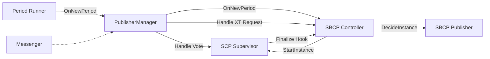
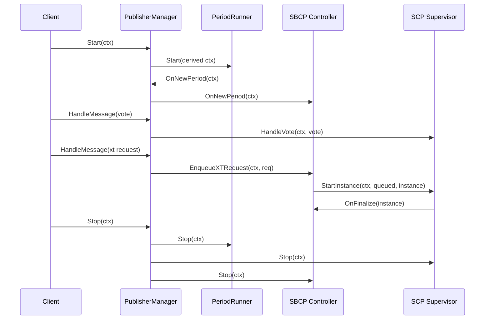

# Publisher Manager

## Components

```mermaid
flowchart LR
    P[Period Runner] -->|OnNewPeriod| MGR[PublisherManager]
    MSG[Messenger] -.-> MGR
    MGR -->|Handle Vote| SUP[SCP Supervisor]
    MGR -->|OnNewPeriod| CTRL[SBCP Controller]
    MGR -->|Handle XT Request| CTRL[SBCP Controller]
    CTRL -->|StartInstance| SUP
    SUP -->|Finalize Hook| CTRL
    CTRL -->|DecideInstance| SBCP[SBCP Publisher]
```

## Lifecycle

```mermaid
sequenceDiagram
    participant Client
    participant MGR as PublisherManager
    participant PR as PeriodRunner
    participant CTRL as SBCP Controller
    participant SUP as SCP Supervisor

    Client->>MGR: Start(ctx)
    MGR->>PR: Start(derived ctx)
    PR-->>MGR: OnNewPeriod(ctx)
    MGR->>CTRL: OnNewPeriod(ctx)

    Client->>MGR: HandleMessage(vote)
    MGR->>SUP: HandleVote(ctx, vote)

    Client->>MGR: HandleMessage(xt request)
    MGR->>CTRL: EnqueueXTRequest(ctx, req)
    CTRL->>SUP: StartInstance(ctx, queued, instance)

    SUP->>CTRL: OnFinalize(instance)

    Client->>MGR: Stop(ctx)
    MGR->>PR: Stop(ctx)
    MGR->>SUP: Stop(ctx)
    MGR->>CTRL: Stop(ctx)
```
