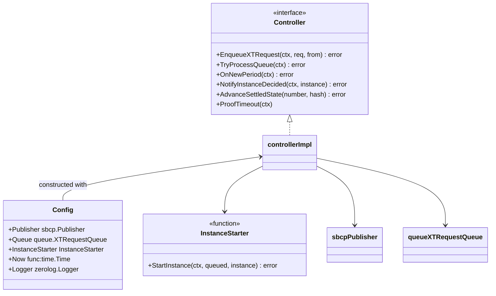
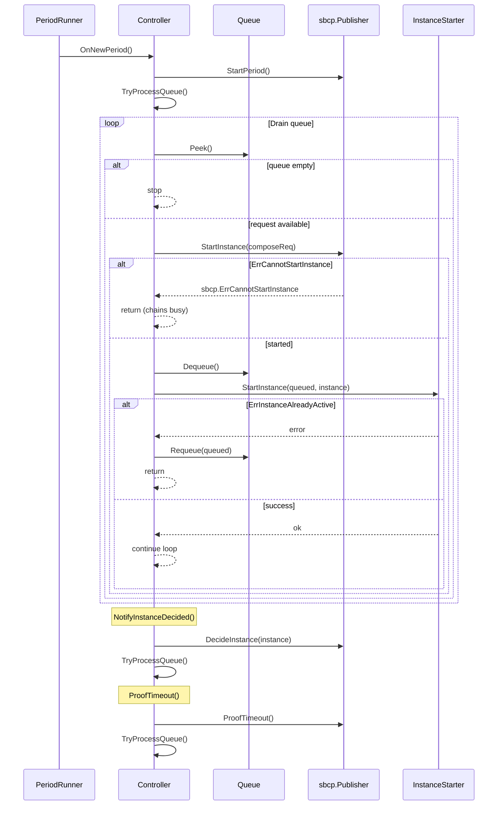

# SBCP Controller

Wraps an `sbcp.Publisher` with queue management, period handling, settled-state updates, and proof-timeout recovery.
SCP instance creation remains delegated to an external `InstanceStarter` (e.g. the SCP Instance Supervisor).

## Architecture

## Sequence

