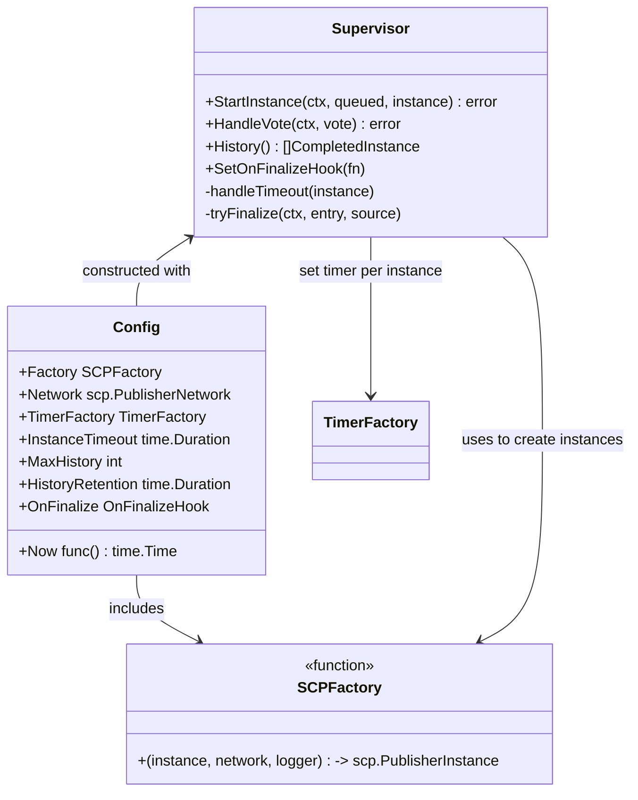
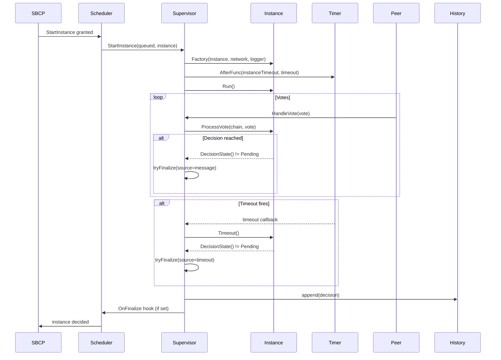

# SCP Instance Supervisor

Supervises the lifecycle of multiple SCP publisher instances: creation, vote handling, timeout management, and finalization.
It exposes a finalize hook for when an instance terminates to trigger follow-up actions (e.g., notify the SBCP) and maintains a bounded/retained history of decisions.

Key responsibilities:
- Create SCP instances via `SCPFactory`, run them, and track them by InstanceID.
- Route votes to instances and finalize when they reach Accepted/Rejected.
- Fire a timer per instance to enforce timeouts; finalize on expiry.
- Use the network to broadcast Decided messages (internal to the SCP instance).
- On finalization, invoke `OnFinalize` if provided.

## Architecture

## Sequence Diagram

