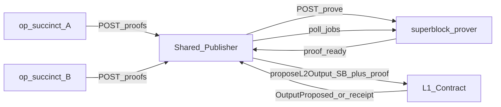

# Superblock Proof Pipeline

The proofs package provides essential types and interfaces for integrating zero-knowledge proof generation and
verification into the Superblock Construction Protocol (SBCP). It enables the collection of individual rollup proofs
from op-succinct instances and coordinates with the superblock-prover to generate final aggregated proofs for L1
submission.

This package is intentionally lightweight to maintain loose coupling with specific prover implementations while
providing a robust foundation for proof-enabled superblock publication.

## Overview

The proof pipeline orchestrates the following workflow:



## Package Layout

- `submission.go`, `status.go`, `aggregation.go` — shared data structures
- `collector/` — collector service interface and in-memory implementation
- `proof_bytes.go` — flexible proof byte encoding/decoding
- `prover_types.go` — prover job structures and interface
- `prover/http_client.go` — HTTP implementation of `ProverClient`
- `../proofs_pipeline.go` — coordinator-managed pipeline that requests proofs and publishes when ready

## Core Components

### Collector API

The collector receives per-rollup proofs and tracks readiness for the prover. Key types:

```go
type Submission struct {
    SuperblockNumber uint64
    SuperblockHash   common.Hash
    ChainID          uint32
    ProverAddress    common.Address
    L1Head           common.Hash
    Aggregation      AggregationOutputs
    L2StartBlock     uint64
    AggVerifyingKey  json.RawMessage
    Proof            []byte
    ReceivedAt       time.Time
}

type Status struct {
    SuperblockHash   common.Hash
    SuperblockNumber uint64
    Required         []uint32
    Received         map[uint32]time.Time
    State            string // collecting|dispatched|proving|complete|failed
    JobID            string
    Error            string
}

type Collector interface {
    SubmitOpSuccinct(ctx context.Context, s Submission) error
    GetStatus(ctx context.Context, sbHash common.Hash) (Status, error)
    ListSubmissions(ctx context.Context, sbHash common.Hash) ([]Submission, error)
    UpdateStatus(ctx context.Context, sbHash common.Hash, mutate func(*Status)) error
}
```

`collector.NewMemory()` provides the in-memory implementation used for local runs and tests.

HTTP endpoints exposed by `http/handler.go`:

| Method | Path                         | Description                               |
|--------|------------------------------|-------------------------------------------|
| POST   | `/v1/proofs/op-succinct`     | Submit a `Submission` payload.            |
| GET    | `/v1/proofs/status/{sbHash}` | Fetch the current `Status` for a superblock hash. |

`AggregationOutputs` matches the op-succinct JSON schema and exposes `ABIEncode()` to produce the `7*32` byte blob required by the prover.

### Prover API

The prover client dispatches aggregated jobs to `superblock-prover` and polls for completion:

```go
type ProverClient interface {
    RequestProof(ctx context.Context, job ProofJobInput) (jobID string, err error)
    GetStatus(ctx context.Context, jobID string) (ProofJobStatus, error)
}

type ProofJobInput struct {
    ProofType string                `json:"proof_type"`
    Input     SuperblockProverInput `json:"input"`
}

type ProofJobStatus struct {
    Status        string `json:"status"`
    Proof         []byte `json:"proof,omitempty"`
    ProvingTimeMS *uint64
    Cycles        *uint64
}

type SuperblockProverInput struct {
    PreviousBatch     SuperblockBatch
    NewBatch          SuperblockBatch
    AggregationProofs []AggregationProofData
}

type SuperblockBatch struct {
    SuperblockNumber            uint64
    ParentSuperblockBatchHash   []int
    RollupSt                    []RollupStateTransition
}

type RollupStateTransition struct {
    RollupConfigHash []byte  // bytes32 - Uniquely identifies a rollup
    L2PreRoot        []byte  // bytes32 - Pre-execution state root
    L2PostRoot       []byte  // bytes32 - Post-execution state root
    L2BlockNumber    []byte  // bytes32 - New L2 block number
}
```

The concrete HTTP implementation lives in `prover/http_client.go` and satisfies the `ProverClient` interface.
It accepts jobs via `POST /proof` and polls `GET /proof/{request_id}` following the contract exposed by the Rust service.

### Public Outputs

`SuperblockAggregationOutputs` mirrors the Solidity struct used as verifier public inputs:

```go
type SuperblockAggregationOutputs struct {
    L1Head           common.Hash
    SuperblockHash   common.Hash
    SuperblockNumber uint64
    ProverAddress    []common.Address
    RollupOutput     []AggregationOutputsWithChainID
}

type AggregationOutputsWithChainID struct {
    ChainID            uint32
    AggregationOutputs json.RawMessage
}
```

`AggregationOutputsWithChainID` embeds each chain’s encoded outputs (`json.RawMessage`) for later ABI packing.

**State Flow**: `collecting` → `dispatched` → `proving` → `complete` | `failed`
